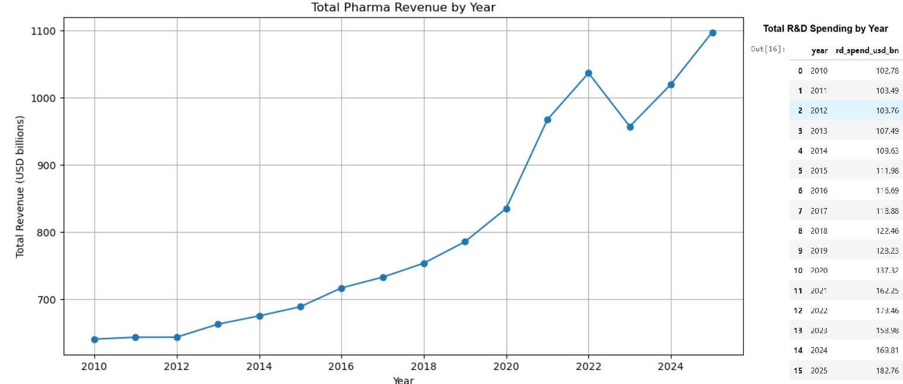
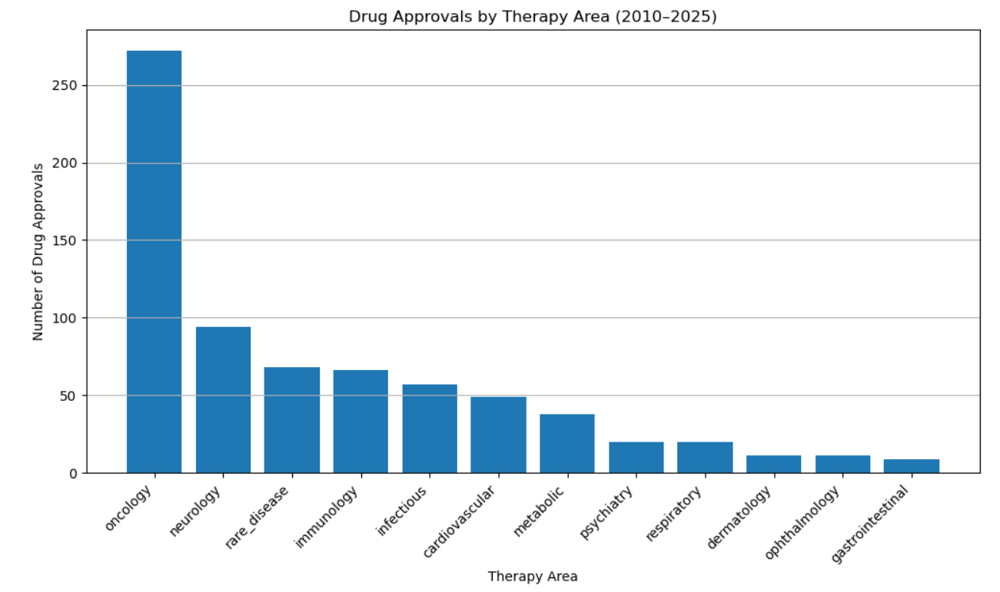
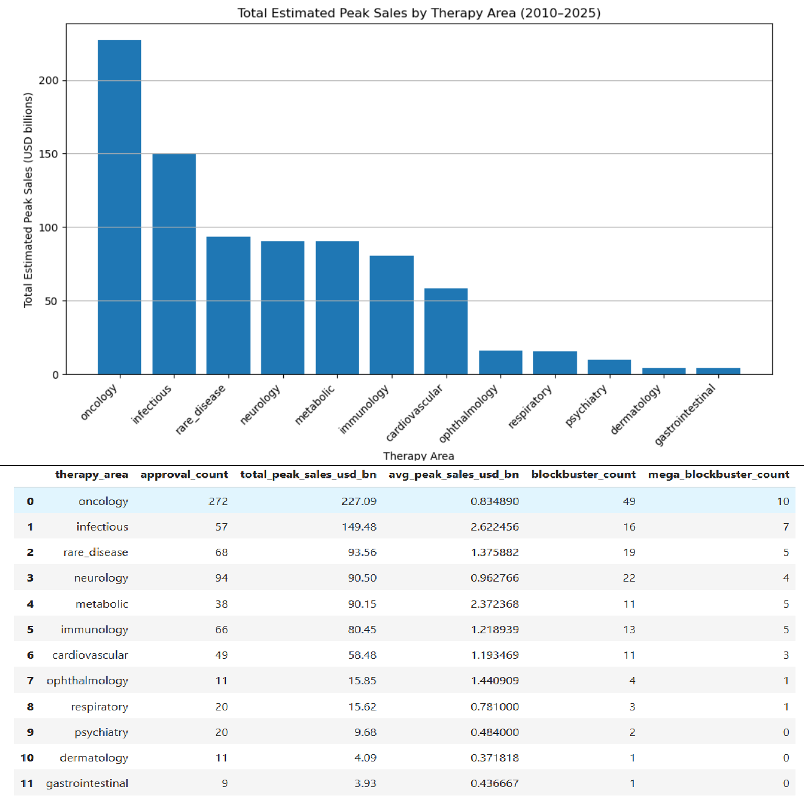
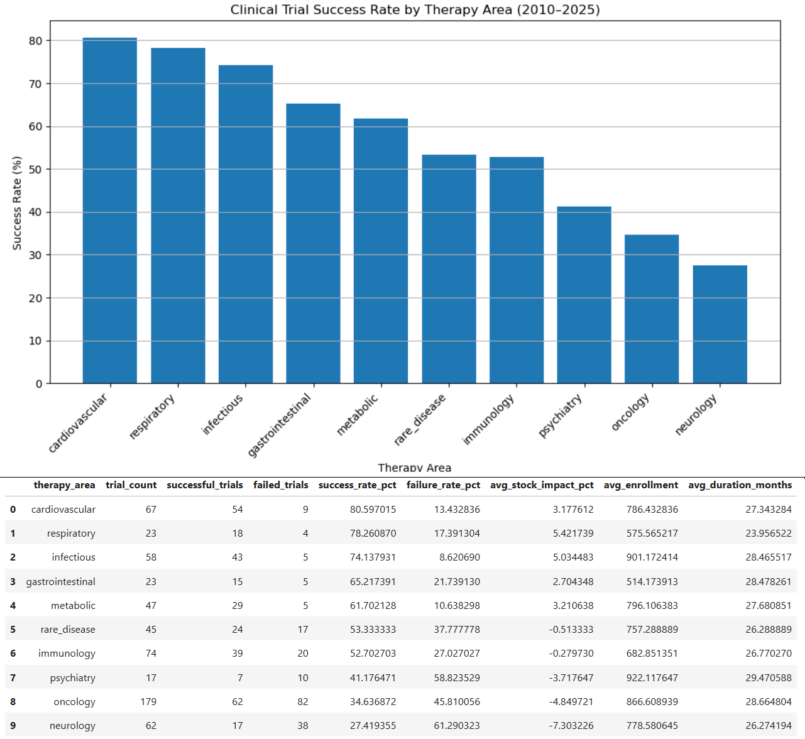
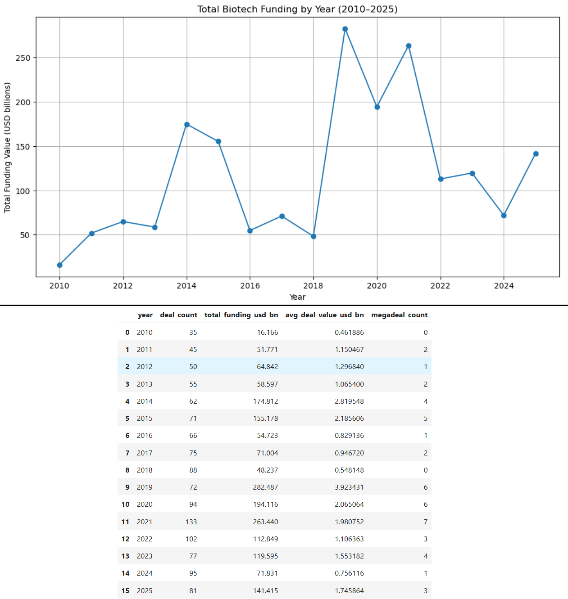
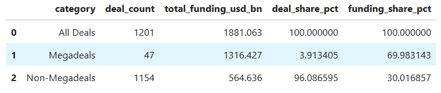
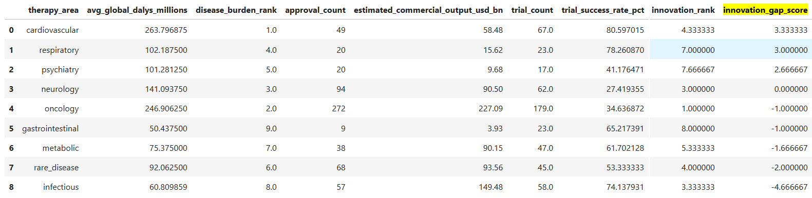

# Global Healthcare & Pharma Innovation Gap Case Study (2010–2025)

A healthcare analytics case study investigating whether pharmaceutical innovation activity aligns with global disease burden.

**Tableau Public Profile:** [Günışığı Aydoğan Tableau Public](https://public.tableau.com/app/profile/g.n.aydo.an/vizzes)  
**Project Type:** Healthcare Analytics Case Study  
**Tools:** Python, Jupyter Notebook, Pandas, NumPy, Matplotlib, Seaborn, Tableau  
**Main Analysis Period:** 2010–2025  

## Tableau Dashboard Pages

- [Global Healthcare & Pharma Market Overview (2010–2025)](https://public.tableau.com/app/profile/g.n.aydo.an/viz/GlobalHealthcarePharmaMarketOverview20102025/ExecutiveOverview)
- [Company Performance & R&D Productivity (2010–2025)](https://public.tableau.com/app/profile/g.n.aydo.an/viz/CompanyPerformanceRDProductivity20102025/CompanyPerformance)
- [Pharmaceutical Innovation Gap by Therapy Area](https://public.tableau.com/app/profile/g.n.aydo.an/viz/PharmaceuticalInnovationGapbyTherapyArea/InnovationGap)
- [Funding & Global Disease Burden](https://public.tableau.com/app/profile/g.n.aydo.an/viz/FundingGlobalDiseaseBurden/FundingBurden)

---

## 1. Case Study Overview

This project is structured as an end-to-end healthcare analytics case study.

Rather than only describing historical trends, the goal is to analyze whether pharmaceutical innovation activity appears aligned with global disease burden. The project examines pharma revenue, R&D spending, drug approvals, clinical trial outcomes, biotech funding, and disease burden to identify potential innovation gaps across therapy areas.

The central question of this case study is:

**Are pharmaceutical innovation efforts aligned with the areas of highest global health burden?**

### Scope

| Area | Description |
|---|---|
| Period | 2010–2025 |
| Industry | Global healthcare and pharmaceutical industry |
| Analytical focus | Innovation alignment, commercial concentration, disease burden |
| Output | Python analysis notebooks, KPI engineering, Tableau dashboards, case study documentation |

The analysis uses 2010–2025 as the main period. Records from 2026 were excluded from the main trend analysis because 2026 may represent a partial year.

---

## 2. Problem Statement

Pharmaceutical innovation does not always follow global disease burden directly.

Innovation activity can be influenced by several factors, including:

- commercial opportunity
- clinical development risk
- regulatory approval dynamics
- R&D investment capacity
- funding concentration
- market incentives
- scientific feasibility

This creates a strategic healthcare analytics problem:

**Do the therapy areas with the highest global disease burden receive proportional innovation activity?**

In other words, this case study asks whether pharma innovation appears to be aligned with public health need, or whether some high-burden areas show signs of possible under-prioritization.

This project does not attempt to prove causality. Instead, it builds an analytical framework to identify patterns, compare relative activity across therapy areas, and highlight areas that may deserve closer investigation.

---

## 3. Analytical Questions

The case study is guided by the following analytical questions:

1. How did global pharma revenue and R&D spending evolve from 2010 to 2025?

2. Did R&D intensity change meaningfully over time?

3. Which companies and segments showed the strongest financial and R&D activity?

4. Which therapy areas dominated drug approvals and estimated commercial output?

5. How do clinical trial success rates differ across therapy areas?

6. Is pharmaceutical innovation activity aligned with global disease burden?

7. Which therapy areas show possible under-prioritization signals?

8. How concentrated is biotech funding across deal types and megadeals?

9. Which regions carry the highest disease burden?

---

## 4. Dataset & Scope

The project uses five datasets covering pharma company financials, drug approvals, clinical trials, biotech funding, and disease burden.

| Dataset | Description |
|---|---|
| `pharma_companies_financials.csv` | Annual company-level financial and R&D metrics for major pharma and healthcare companies |
| `drug_approvals.csv` | Drug approval records with sponsor company, therapy area, drug type, and estimated peak sales |
| `clinical_trials.csv` | Clinical trial records with phase, therapy area, outcome, success/failure flags, and estimated stock impact |
| `biotech_funding.csv` | Biotech funding and deal records including deal type, value, acquirer/investor, and megadeal flag |
| `disease_burden.csv` | Disease burden data by year, region, and disease group using DALYs |

For detailed field definitions, see:

[`docs/data_dictionary.md`](docs/data_dictionary.md)

For the project framing and analytical intent, see:

[`docs/project_manifesto.md`](docs/project_manifesto.md)

---

## 5. Methodology

The project follows a structured analytics workflow:

1. **Data quality check**  
   Checked dataset structure, missing values, duplicates, date fields, data types, and time coverage.

2. **Exploratory data analysis**  
   Explored record counts, yearly trends, therapy areas, companies, trial outcomes, funding patterns, and disease burden distributions.

3. **Financial performance analysis**  
   Analyzed pharma revenue, R&D spending, R&D intensity, operating margins, company segments, and company-level growth patterns.

4. **Drug approval and clinical trial analysis**  
   Analyzed approval activity by year, company, therapy area, and drug type. Clinical trials were analyzed by phase, outcome, therapy area, success rate, and estimated stock impact.

5. **Biotech funding and disease burden analysis**  
   Analyzed biotech funding trends, deal types, average deal size, megadeal concentration, and regional disease burden patterns.

6. **KPI engineering**  
   Created company-level and therapy-area-level KPIs for analytical comparison and Tableau dashboard development.

7. **Innovation gap score design**  
   Built an innovation gap framework comparing disease burden rank with innovation activity rank.

8. **Tableau dashboard preparation**  
   Exported Tableau-ready CSV files and built dashboard pages for market overview, company performance, innovation gap, and funding/burden analysis.

### Notebook Workflow

| Notebook | Purpose |
|---|---|
| `01_data_quality_check.ipynb` | Data loading, quality review, missing values, duplicates, date conversion |
| `02_financial_performance_eda.ipynb` | Financial performance, revenue, R&D spending, R&D intensity, company analysis |
| `03_drug_approvals_and_clinical_trials_eda.ipynb` | Drug approvals, therapy areas, clinical trials, success rates |
| `04_biotech_funding_and_disease_burden_eda.ipynb` | Biotech funding, megadeals, disease burden, regional patterns |
| `05_kpi_engineering_and_innovation_gap_analysis.ipynb` | KPI engineering, disease-to-therapy mapping, innovation gap score |
| `06_dashboard_data_preparation.ipynb` | Tableau-ready dashboard export files |

---

## 6. KPI Engineering & Innovation Gap Framework

The most important analytical layer of this project is the innovation gap framework.

The goal was to compare disease burden with pharmaceutical innovation activity across therapy areas.

### Company-Level KPIs

Company-level KPIs were created to compare financial scale, R&D investment, approval activity, and commercial productivity.

Examples include:

- total revenue
- total R&D spending
- R&D intensity
- total approvals
- blockbuster count
- estimated commercial output
- approval productivity per billion dollars of R&D spending
- commercial output per billion dollars of R&D spending

### Therapy-Area Innovation KPIs

Therapy-area KPIs were created to compare innovation activity across therapeutic areas.

Examples include:

- approval count
- estimated commercial output
- average peak sales estimate
- clinical trial count
- successful trials
- failed trials
- trial success rate
- average estimated stock impact
- disease burden rank
- innovation activity rank
- innovation gap score

### Disease-to-Therapy Mapping

Disease burden data was organized by disease group, while drug approvals and clinical trials were organized by therapy area.

To compare both sides, disease groups were mapped to therapy areas. For example:

| Disease Group | Mapped Therapy Area |
|---|---|
| Cancer | Oncology |
| Cardiovascular disease | Cardiovascular |
| Stroke | Cardiovascular |
| Neurological disorders | Neurology |
| Alzheimer's & dementias | Neurology |
| Mental disorders | Psychiatry |
| Diabetes | Metabolic |
| Chronic respiratory | Respiratory |
| Lower respiratory infections | Infectious |
| Tuberculosis | Infectious |
| Malaria | Infectious |
| HIV/AIDS | Infectious |
| COVID-19 | Infectious |
| Liver disease | Gastrointestinal |
| Kidney disease | Gastrointestinal |
| Neonatal disorders | Rare disease |

This mapping is an analytical assumption and should be interpreted with caution.

### Innovation Gap Score

The innovation gap score compares disease burden rank with innovation activity rank.

The framework uses:

- disease burden rank
- approval rank
- commercial output rank
- trial activity rank
- combined innovation rank
- innovation gap score

Interpretation:

| Innovation Gap Score | Interpretation |
|---|---|
| Positive score | Possible under-prioritization relative to disease burden |
| Negative score | Stronger innovation concentration relative to disease burden |
| Near zero | Closer alignment between burden and innovation activity |

The innovation gap score is not a causal metric. It is an analytical signal used to compare relative disease burden with relative innovation activity across therapy areas.

---

## 7. Key Findings from Python Analysis

This section summarizes the main findings from the Python/Jupyter analysis.

Selected notebook charts are included to support the case study narrative.

---

### Finding 1: Pharma revenue and R&D spending increased substantially



Between 2010 and 2025, total pharma revenue and R&D spending both increased significantly.

Key observation:

- Total revenue grew from approximately **$640.2B** in 2010 to **$1,096.6B** in 2025.
- Total R&D spending grew from approximately **$102.8B** to **$182.8B**.
- R&D intensity remained relatively stable around **16–17%**.

Interpretation:

The industry expanded financially, and R&D spending increased with it. However, relatively stable R&D intensity suggests that R&D investment grew broadly in line with revenue rather than representing a major structural increase in R&D commitment.

This provides the market context for the case study: the industry grew, but the next question is where innovation activity was concentrated.

---

### Finding 2: Oncology dominates drug approvals



Drug approval activity was not evenly distributed across therapy areas.

Key observation:

- Oncology had the highest number of approvals.
- Neurology, rare disease, immunology, infectious disease, cardiovascular, and metabolic areas followed at lower levels.

Interpretation:

Oncology appears as the strongest therapy area by approval count. This suggests a high level of innovation concentration in cancer-related treatments.

Approval count alone does not fully explain innovation value, so estimated commercial output was also analyzed.

---

### Finding 3: Oncology also leads estimated commercial output



Estimated commercial output was analyzed using estimated peak sales potential.

Key observation:

- Oncology generated the highest estimated commercial output.
- Infectious disease also showed strong commercial output, partly reflecting the COVID-era and vaccine-related dynamics.
- Other therapy areas showed meaningful but lower estimated commercial potential.

Interpretation:

Oncology dominates not only in approval count but also in estimated commercial output. This makes oncology one of the clearest examples of therapy-area innovation concentration.

This does not mean oncology is over-prioritized in absolute terms, because cancer is also a major global disease burden. However, it does show that innovation and commercial potential are heavily concentrated in this area.

---

### Finding 4: Clinical trial success differs strongly across therapy areas



Clinical trial success rates varied significantly across therapy areas.

Key observation:

- Cardiovascular, respiratory, and infectious disease showed stronger trial success rates.
- Oncology and neurology showed lower clinical trial success rates.
- Phase 3 trials showed a lower success profile than Phase 2 trials in the dataset.

Interpretation:

Innovation activity should not be evaluated only through approval counts or commercial output. Clinical development risk matters.

A therapy area may attract strong investment and approval activity while also carrying significant trial risk. Oncology is a good example: it shows strong approval and commercial activity, but lower clinical trial success rates compared with several other therapy areas.

---

### Finding 5: Biotech funding is volatile and concentrated



Biotech funding showed more volatility than pharma revenue and R&D spending.

Key observation:

- Funding peaked strongly in certain years, especially around 2019 and 2021.
- Funding patterns were heavily influenced by large transactions.

Interpretation:

Unlike company revenue or R&D spending, biotech funding does not follow a smooth trend. It is more sensitive to deal cycles, market conditions, and large transactions.

This matters because funding availability can shape innovation momentum, but it may not align directly with disease burden.

---

### Finding 6: Megadeals account for most funding value despite being few in number



Megadeals represented a small share of total deal count but accounted for the majority of total biotech funding value.

Key observation:

- A small number of megadeals dominated total funding value.
- Non-megadeals represented most deal activity by count but a much smaller share of funding value.

Interpretation:

Biotech funding is highly concentrated. Looking only at deal count can hide the importance of large transactions.

This supports the funding concentration side of the case study: capital allocation is not evenly distributed, and a small number of large deals can shape the overall funding landscape.

---

### Finding 7: Innovation gap analysis highlights possible under-prioritized areas



The innovation gap score compares disease burden rank with innovation activity rank.

Key observation:

- Cardiovascular disease showed the strongest positive innovation gap signal.
- Respiratory and psychiatry also showed positive innovation gap signals.
- Infectious disease showed strong innovation activity relative to burden rank.
- Oncology showed strong innovation activity and commercial concentration.

Interpretation:

A positive innovation gap score suggests that a therapy area may have higher disease burden relative to its observed innovation activity.

This does not prove neglect or underinvestment. However, it highlights areas where burden-adjusted innovation activity may deserve closer attention.

---

### Finding 8: Disease burden rank and innovation rank are not always aligned

The comparison between disease burden rank and innovation rank shows that innovation activity does not perfectly follow disease burden.

Key observation:

- Some high-burden areas show weaker innovation ranking.
- Some therapy areas show stronger innovation ranking relative to their burden ranking.
- The relationship between disease burden and innovation activity is uneven.

Interpretation:

This chart supports the central case study argument: pharmaceutical innovation activity appears shaped by more than disease burden alone.

Commercial potential, scientific feasibility, clinical risk, funding dynamics, and market incentives likely influence where innovation activity concentrates.

---

### Finding 9: Disease burden is regionally concentrated

Disease burden was not evenly distributed across regions.

Key observation:

- Africa, India, China, and Southeast Asia carried the highest total disease burden in the dataset.
- Regional burden patterns differ from pharma company and funding concentration patterns.

Interpretation:

The regional disease burden view adds a global health context to the case study.

It raises a broader question: even when innovation activity is strong at the industry level, is it aligned with the regions and disease areas where health burden is highest?

---

## 8. Tableau Dashboard Story

The Tableau dashboards translate the Python analysis into an executive-level visual story.

Each dashboard is designed to answer a different layer of the case study.

---

### Dashboard 1: Global Healthcare & Pharma Market Overview (2010–2025)

[View dashboard on Tableau Public](https://public.tableau.com/app/profile/g.n.aydo.an/viz/GlobalHealthcarePharmaMarketOverview20102025/ExecutiveOverview)


#### What this dashboard shows

This dashboard provides a high-level overview of the global healthcare and pharma market between 2010 and 2025.

It tracks:

- total pharma revenue
- total R&D spending
- R&D intensity
- drug approvals
- clinical trial activity
- biotech funding
- disease burden

#### Key points

- Pharma revenue and R&D spending increased substantially from 2010 to 2025.
- R&D intensity remained relatively stable.
- Biotech funding was more volatile than revenue or R&D spending.
- Disease burden increased notably around the COVID-era period.

#### Interpretation

The market overview dashboard establishes the industry context.

The industry expanded financially, and R&D spending increased, but relatively stable R&D intensity suggests that the relationship between revenue and R&D commitment remained broadly consistent.

This creates the foundation for the rest of the case study: if the industry grew and R&D spending increased, the next question is whether innovation activity aligned with global health needs.

#### Case study relevance

This dashboard answers the first layer of the case study:

**How did the overall pharma market, R&D activity, funding environment, and disease burden evolve over time?**

---

### Dashboard 2: Company Performance & R&D Productivity (2010–2025)

[View dashboard on Tableau Public](https://public.tableau.com/app/profile/g.n.aydo.an/viz/CompanyPerformanceRDProductivity20102025/CompanyPerformance)


#### What this dashboard shows

This dashboard compares companies by:

- total revenue
- total R&D spending
- R&D intensity
- approval output
- estimated commercial output
- commercial output per R&D spending
- company segment

#### Key points

- Large pharma companies dominate total revenue and R&D spending.
- Biotech companies tend to show higher R&D intensity despite smaller scale.
- Commercial output per R&D varies substantially across companies.
- Productivity metrics require careful interpretation alongside total R&D base and approval count.

#### Interpretation

The company-level view shows that innovation capacity is not only about company size.

Large companies dominate total financial scale, but smaller or more specialized companies can show stronger R&D intensity or productivity patterns.

This dashboard helps separate three ideas that are often mixed together:

1. financial scale
2. R&D commitment
3. innovation productivity

#### Case study relevance

This dashboard answers the company-level layer of the case study:

**Which companies and segments showed the strongest financial and R&D activity, and how did innovation productivity differ across them?**

---

### Dashboard 3: Pharmaceutical Innovation Gap by Therapy Area

[View dashboard on Tableau Public](https://public.tableau.com/app/profile/g.n.aydo.an/viz/PharmaceuticalInnovationGapbyTherapyArea/InnovationGap)


#### What this dashboard shows

This is the core dashboard of the case study.

It compares therapy areas by:

- disease burden
- approval count
- estimated commercial output
- clinical trial activity
- clinical trial success rate
- innovation rank
- innovation gap score

#### Key points

- Oncology shows strong innovation concentration.
- Cardiovascular disease shows the strongest positive innovation gap signal.
- Respiratory and psychiatry also show possible under-prioritization signals.
- Infectious disease shows strong innovation activity relative to burden rank.
- Clinical trial success rates differ substantially across therapy areas.

#### Interpretation

The Innovation Gap dashboard suggests that pharmaceutical innovation activity is not evenly aligned with global disease burden.

Some therapy areas show strong innovation concentration, especially oncology and infectious disease. Other high-burden areas, such as cardiovascular disease, show positive innovation gap signals.

This does not prove that these areas are neglected. However, it highlights therapy areas where disease burden appears stronger than relative innovation activity.

#### Case study relevance

This dashboard directly answers the central case study question:

**Is pharmaceutical innovation activity aligned with global disease burden across therapy areas?**

---

### Dashboard 4: Funding & Global Disease Burden

[View dashboard on Tableau Public](https://public.tableau.com/app/profile/g.n.aydo.an/viz/FundingGlobalDiseaseBurden/FundingBurden)


#### What this dashboard shows

This dashboard analyzes biotech funding concentration and regional disease burden.

It includes:

- funding by deal type
- average deal size by deal type
- megadeal funding share
- megadeal deal count share
- regional disease burden

#### Key points

- M&A dominates total biotech funding value.
- VC activity may be more frequent by deal count but smaller in average deal size.
- Megadeals represent a small share of total deal count but account for the majority of total funding value.
- Disease burden is concentrated in Africa, India, China, and Southeast Asia.

#### Interpretation

The Funding & Burden dashboard shows that biotech funding is highly concentrated.

A small number of large deals can dominate total funding value, while disease burden is concentrated across specific regions. This creates an important contrast between capital allocation patterns and global health burden patterns.

#### Case study relevance

This dashboard supports the funding and global burden layer of the case study:

**How concentrated is biotech funding, and how does regional disease burden provide context for the innovation alignment question?**

---

## 9. Final Answers to Analytical Questions

### 1. How did global pharma revenue and R&D spending evolve from 2010 to 2025?

Pharma revenue and R&D spending increased significantly between 2010 and 2025.

Revenue grew from approximately **$640.2B** in 2010 to **$1,096.6B** in 2025. R&D spending grew from approximately **$102.8B** to **$182.8B**.

### 2. Did R&D intensity change meaningfully over time?

R&D intensity remained relatively stable around **16–17%**.

This suggests that R&D spending grew broadly in line with revenue, rather than showing a major structural shift in R&D commitment.

### 3. Which companies and segments showed the strongest financial and R&D activity?

Large pharma companies dominated total revenue and total R&D spending.

Biotech companies showed higher R&D intensity on average, reflecting a stronger R&D-heavy business model relative to revenue scale.

### 4. Which therapy areas dominated drug approvals and estimated commercial output?

Oncology dominated drug approvals and estimated commercial output.

This suggests strong innovation concentration in cancer-related treatments.

### 5. How do clinical trial success rates differ across therapy areas?

Clinical trial success rates differed substantially across therapy areas.

Cardiovascular, respiratory, and infectious disease showed stronger success rates, while oncology and neurology showed lower success rates in the dataset.

### 6. Is pharmaceutical innovation activity aligned with global disease burden?

The alignment appears uneven.

Some high-burden areas also show strong innovation activity, but others show possible under-prioritization signals when disease burden rank is compared with innovation activity rank.

### 7. Which therapy areas show possible under-prioritization signals?

Cardiovascular disease showed the strongest positive innovation gap signal.

Respiratory and psychiatry also showed positive innovation gap signals.

These should be interpreted as analytical signals, not definitive proof of neglect.

### 8. How concentrated is biotech funding across deal types and megadeals?

Biotech funding is highly concentrated.

Megadeals represented a small share of total deal count but accounted for the majority of total funding value.

### 9. Which regions carry the highest disease burden?

Disease burden was concentrated in Africa, India, China, and Southeast Asia.

This regional burden concentration adds global health context to the innovation alignment question.

---

## 10. Limitations

This case study has several important limitations.

- The innovation gap score is an analytical proxy, not a causal measure.
- Disease-to-therapy-area mapping required assumptions.
- Some diseases may overlap multiple therapy areas.
- Funding data could not be reliably mapped to therapy areas using available descriptions, so funding was not directly included in the innovation gap score.
- 2026 was excluded from the main trend analysis because it may represent an incomplete year.
- Regional disease burden was analyzed at a broad regional level, not at detailed country-level granularity.
- Estimated commercial output is based on peak sales estimates, not realized revenue.
- Clinical trial stock impact is an estimated proxy, not a confirmed market reaction.
- The analysis identifies possible signals and patterns, not definitive evidence of underinvestment, neglect, or overinvestment.

These limitations are important because the project is intended to support structured analytical thinking, not to make absolute claims about the causes of pharmaceutical innovation patterns.

---

## 11. Repository Structure

```text
healthcare-pharma-innovation-gap-case-study/
│
├── README.md
├── requirements.txt
├── .gitignore
│
├── data/
│   ├── About-Dataset.txt
│   ├── clinical_trials.csv
│   ├── disease_burden.csv
│   ├── biotech_funding.csv
│   ├── drug_approvals.csv
│   └── pharma_companies_financials.csv
│
├── notebooks/
│   ├── 01_data_quality_check.ipynb
│   ├── 02_financial_performance_eda.ipynb
│   ├── 03_drug_approvals_and_clinical_trials_eda.ipynb
│   ├── 04_biotech_funding_and_disease_burden_eda.ipynb
│   ├── 05_kpi_engineering_and_innovation_gap_analysis.ipynb
│   └── 06_dashboard_data_preparation.ipynb
│
├── exports/
│   ├── company_kpis_dashboard.csv
│   ├── therapy_area_innovation_gap_dashboard.csv
│   ├── yearly_trends_dashboard.csv
│   ├── funding_deal_type_dashboard.csv
│   ├── megadeal_summary_dashboard.csv
│   └── regional_disease_burden_dashboard.csv
│
├── assets/
│   ├── dashboard_screenshots/
│   │   ├── executive_overview.png
│   │   ├── company_performance.png
│   │   ├── innovation_gap.png
│   │   └── funding_and_burden.png
│   │
│   └── notebook_charts/
│       ├── revenue_rd_trends.png
│       ├── approvals_by_therapy_area.png
│       ├── commercial_output_by_therapy_area.png
│       ├── trial_success_by_therapy_area.png
│       ├── biotech_funding_by_year.png
│       ├── megadeal_funding_share.png
│       ├── innovation_gap_score.png
│       ├── burden_vs_innovation_scatter.png
│       └── regional_disease_burden.png
│
├── docs/
│   ├── project_manifesto.md
│   └── data_dictionary.md
│
└── tableau/
    ├── healthcare_pharma_dashboard.twbx
    └── dashboard_notes.md
